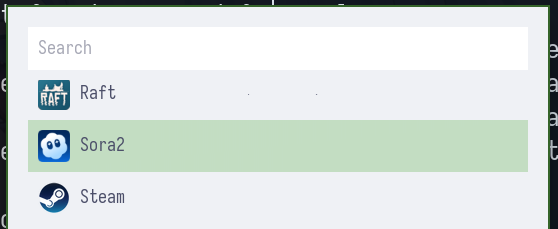
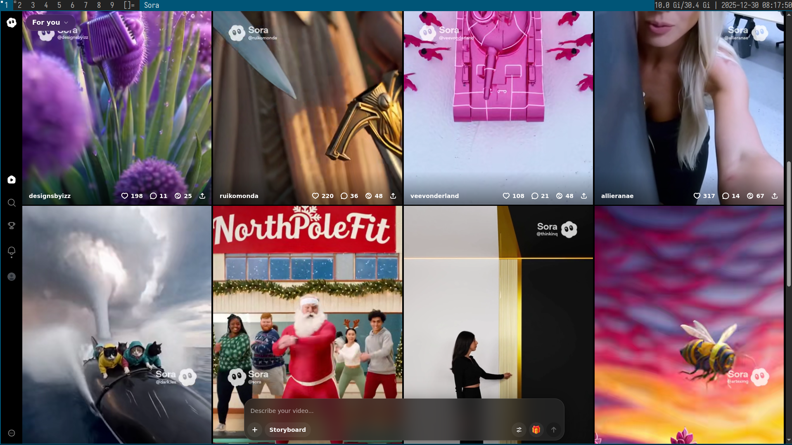
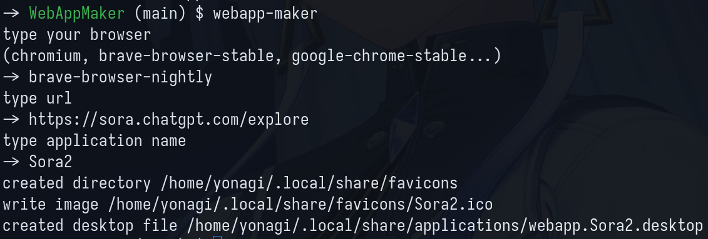

# WebApp Maker




## How to use



1. run `webapp-maker`
1. type your browser
1. type url
1. type application name

## Requirements

- bun
- make

## Installation

To install webapp-maker:

```bash
make install
```

## Compile

To compile:

```bash
bun compile
```

## Development

To install dependencies:

```bash
bun install
```

To run:

```bash
bun start
```
